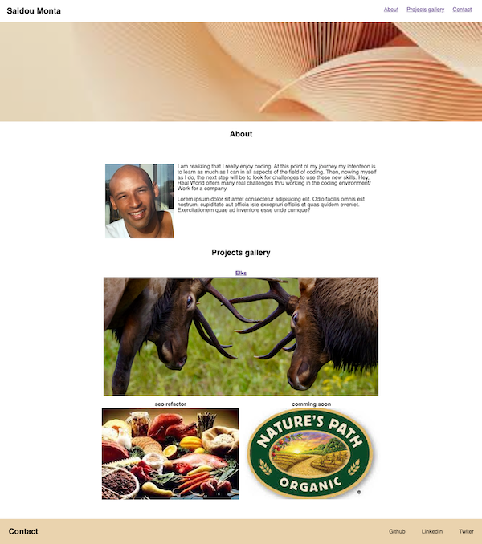
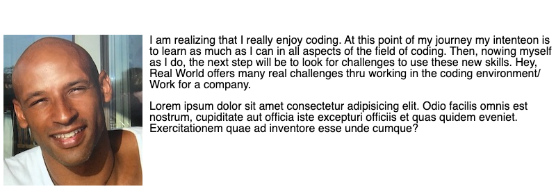
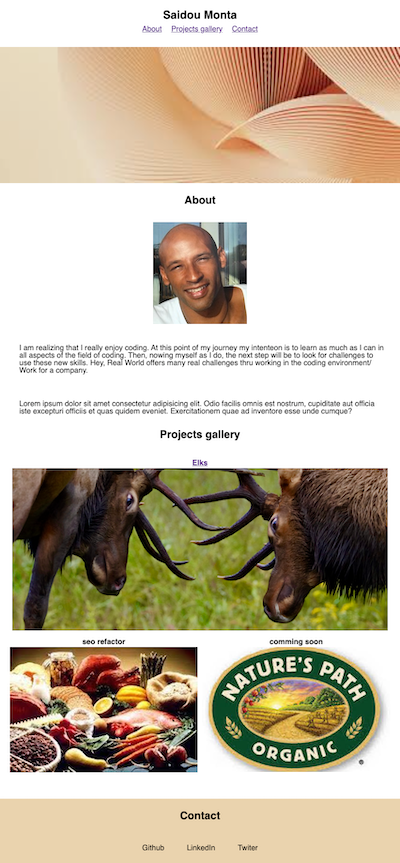

## [My-Resume](https://saidou25.github.io/My-Resume/)




This is my virtual resume built using:


- HTML identation: To facilitate the reading of the code.
- HTML semantic: For accessibility.
- Attributes: To empliment such as "a" and "id" for links.

Example used for the navigation bar   .

             <li>
                   <a href="#About">About</a> 
                 </li>
                 <li>
                    <a href="#Projects-gallery">Projects gallery</a>
                 </li>          
                 <li>
                    <a href="#Contact">Contact</a>
                 </li>
                
- FlexBox: For display of elements within parts of the page.

Example used for the About section in css file.

```
.first-section {
    display: flex;
    padding-top: 50px;
    max-width: 800px;
    margin: auto;
  }
```




- MediaQuery: To adapt the page overlay to different screen formats.

```
@media screen and (max-width: 992px)  {

    .header  {
        display: flex;
        flex-direction: column;
        justify-content: center;
             }
    }
```




